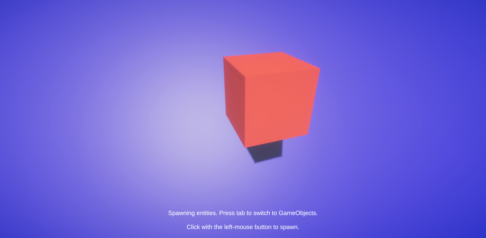

# PostAuthoringURPHybridRendererV2Bug

Unity project demonstrating a bug where entities created at runtime are invisible, as opposed to those created during authoring.

## Versions of Things

The editor used is **2020.2.1**.

Here are packages used pertinent to the sample scene (copied from `manifest.json`):

```json
...
"com.unity.entities": "0.16.0-preview.21",
"com.unity.physics": "0.5.1-preview.2",
"com.unity.render-pipelines.universal": "10.2.2",
"com.unity.rendering.hybrid": "0.10.0-preview.21",
"com.unity.test-framework": "1.1.20",
"com.unity.textmeshpro": "3.0.3",
...
```

## The Sample Scene



Note in the screenshot above that the red cube was created during authoring via a `ConvertToEntity` script with GameObject injection enabled. In fact, the blue backdrop was created the same way. By left-clicking on the blue backdrop, more cubes are spawned at runtime. If spawning entities, they will be invisible, but they will be present within the `Entity Debugger`. **This constitutes a bug.** I, the user, expect runtime entities to work like authoring entities.

This is **not**, by the way, an SRP batcher issue per se—it's actually disabled!

You can press `Tab` to switch to spawning GameObjects, just to visually show that the spawn position logic works fine.

## Project Layout

This is a standard project layout, and it's barebones. Note that the spawning system is `Assets/Scripts/SpawningSystem.cs`. Cube authoring is `Assets/Scripts/Cube.cs`. The sample scene is `Assets/Scenes/SampleScene.Unity`.
